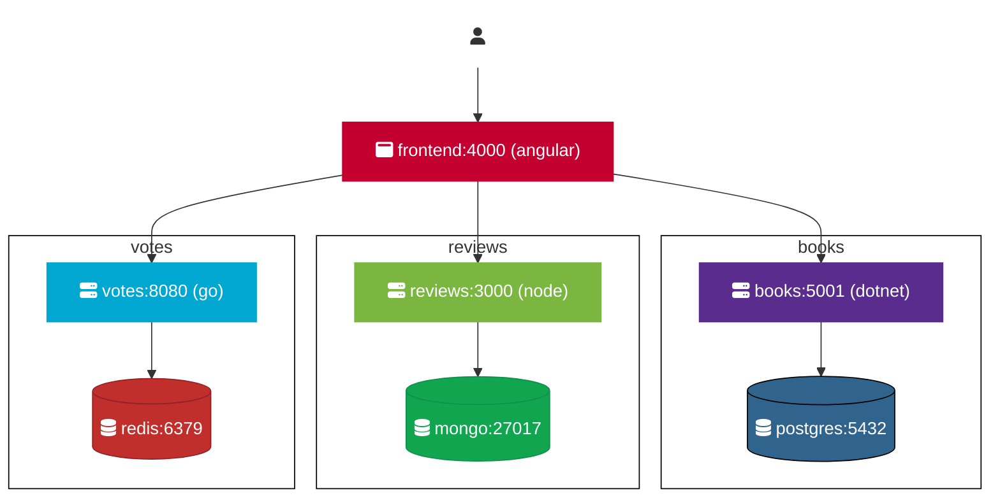

# BookStore

Kubernetes E-commerce BookStore application - Redes y Sistemas

This project is part of the Networks and Systems course and involves deploying an E-commerce application using modern containerization and orchestration technologies. The application consists of a web client, a REST API backend, and a relational database.

Technologies Used
Web Client: React
Backend: Golang
Database: PostgreSQL
Containerization: Docker
Orchestration: Kubernetes
Local Development: Docker Compose

.
├── books/                  # database of votes and DockerField
├── reviews/                # Database configuration scripts
├── kubernetes/             # Kubernetes configurations (pods, services, deployments)
├── frontend/               # Angular web client code
├── docker-compose.yml      # Docker Compose configuration for local development
├── votes/                  #db of votes and DockerField
├── README.md               # This file

#Setup and Deployment

Prerequisites
Docker
Docker Compose
Kubernetes (Minikube for local development or a Kubernetes cluster)

#Initial Setup
docker-compose up
Start services with Docker Compose (for local development)

#Deploy on Kubernetes

For kubernetes there are prepared manifests in kubernetes folder

#Endpoints
Services are so simple that there is no need to describe each endpoint and it should be easy to determine what endpoins do we have, but just in case here are some common ones used by frontend to retrieve data:

http://localhost:5001/v1/books
http://localhost:5001/v1/books/2
http://localhost:3000/v1/books/2/reviews
http://localhost:8080/v1/books/2/votes

The REST API is exposed at http://localhost:5000 (or the corresponding URL if using Kubernetes).

